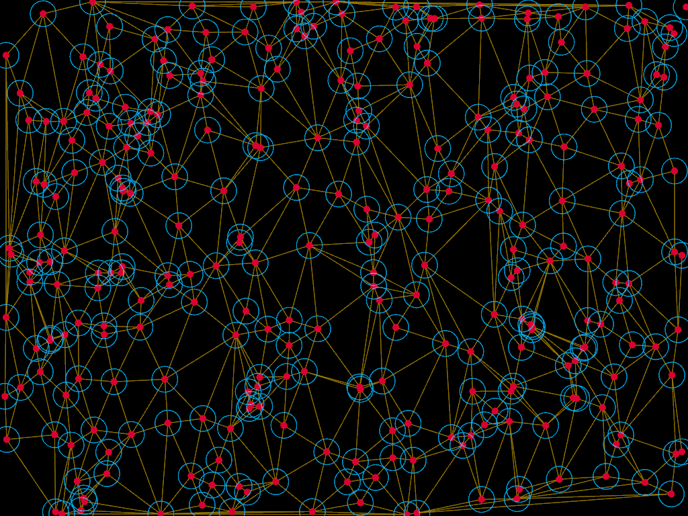
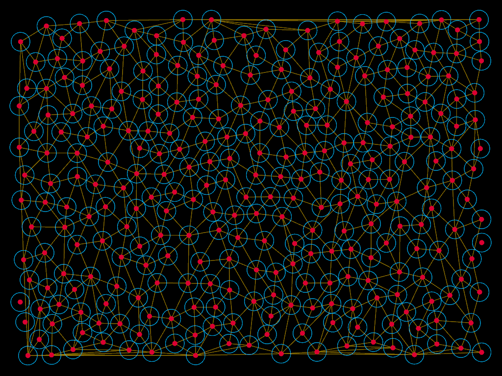

ofxPoissonDiskSampling
================

An OpenFrameworks wrapper for Poisson Disk Sampling, a method to generate random points in space with some randomness.

The code uses C++11 (but could easily be rewritten to conform to C++98).

The following images show the difference between true randomness and Poisson Disk Sampling. I ran a Delaunay triangulation on both sets of samples.

